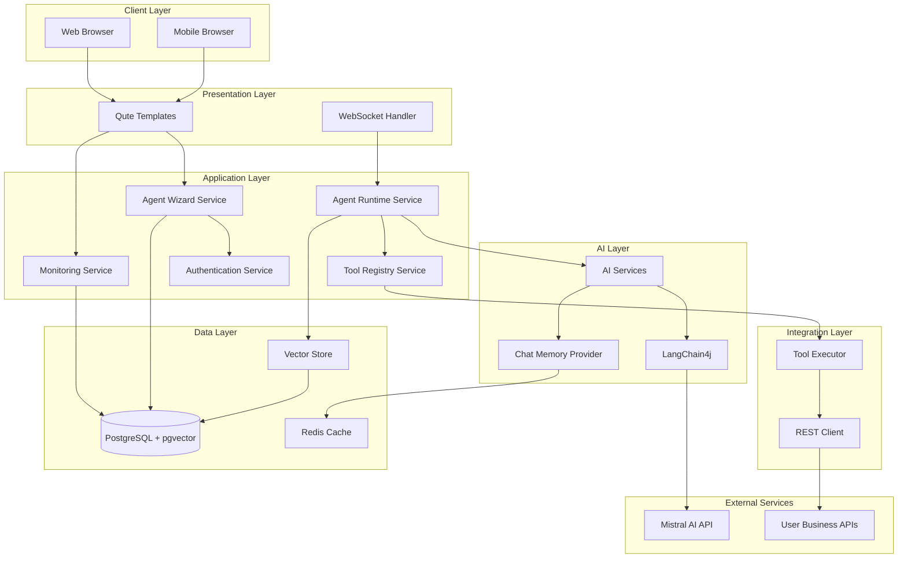

# Design Document: AI Agent Platform

## Overview

The AI Agent Platform is a web-based system that democratizes AI agent creation for non-technical users. Built on Quarkus for high-performance Java backend services and LangChain4j for AI orchestration, the platform provides an intuitive interface using Qute templates. The architecture follows cloud-native principles with support for horizontal scaling, containerization, and Kubernetes deployment.

The platform enables users to create custom AI agents through a guided wizard, integrate with external APIs and business systems, monitor agent performance, and manage costs effectively. The system leverages Mistral AI models for natural language processing while maintaining flexibility to support multiple LLM providers.

## Architecture

### High-Level Architecture



### Technology Stack

- **Backend Framework**: Quarkus 3.x with Panache for ORM
- **AI Framework**: LangChain4j with Quarkus extensions
- **Template Engine**: Qute for server-side rendering
- **Frontend CSS**: Tailwind CSS for modern, responsive UI
- **UI Components**: Alpine.js for interactive components
- **Icons**: Heroicons or Lucide icons
- **Database**: PostgreSQL 15+ with pgvector extension
- **Caching**: Redis for session and memory management
- **LLM Provider**: Mistral AI (primary), extensible to others
- **Security**: Quarkus Security with JWT/OAuth2
- **Deployment**: Docker containers, Kubernetes-ready
- **Monitoring**: Micrometer with Prometheus metrics

### Deployment Architecture

The platform follows a cloud-native, microservices-ready architecture:

- **Stateless Application Pods**: Multiple replicas for high availability
- **Persistent Storage**: PostgreSQL cluster with replication
- **Caching Layer**: Redis cluster for distributed sessions
- **Load Balancer**: Kubernetes Ingress or cloud load balancer
- **Auto-scaling**: Horizontal Pod Autoscaler based on CPU/memory metrics

## Components and Interfaces

### 1. Agent Wizard Service

**Responsibility**: Manages the agent creation workflow through a multi-step wizard interface.

**Key Operations**:
- `createAgentSession()`: Initialize wizard session
- `saveWizardStep(stepData)`: Persist wizard progress
- `validateConfiguration(config)`: Validate agent settings
- `deployAgent(agentConfig)`: Create and activate agent
- `previewAgent(config)`: Test agent before deployment

**Dependencies**:
- Authentication Service for user validation
- Agent Repository for persistence
- AI Service for configuration validation

**Interface**:
```java
@ApplicationScoped
public class AgentWizardService {
    
    public AgentWizardSession createSession(User user);
    
    public void saveStep(UUID sessionId, WizardStep step, Map<String, Object> data);
    
    public ValidationResult validateConfiguration(AgentConfiguration config);
    
    public Agent deployAgent(AgentConfiguration config, User owner);
    
    public PreviewResponse previewAgent(AgentConfiguration config, String testPrompt);
}
```

### 2. Agent Runtime Service

**Responsibility**: Executes agent interactions, manages conversation flow, and coordinates tool usage.

**Key Operations**:
- `processMessage(agentId, message, context)`: Handle user input
- `streamResponse(agentId, message)`: Stream AI responses via WebSocket
- `executeToolChain(tools, context)`: Orchestrate tool execution
- `manageConversationMemory(sessionId)`: Handle chat history

**Dependencies**:
- LangChain4j from Quarkus Extension AI Services
- Tool Registry for tool resolution
- Chat Memory Provider for conversation context
- Monitoring Service for metrics

**Interface**:
```java
@ApplicationScoped
public class AgentRuntimeService {
    
    @Inject
    @RegisterAiService(modelName = "mistral")
    AgentAIService aiService;
    
    public CompletionStage<AgentResponse> processMessage(
        UUID agentId, 
        String message, 
        ConversationContext context
    );
    
    public Multi<String> streamResponse(UUID agentId, String message);
    
    public ToolExecutionResult executeToolChain(
        List<Tool> tools, 
        Map<String, Object> context
    );
}
```

### 3. Tool Registry Service

**Responsibility**: Manages custom tools, API integrations, and tool discovery for agents.

**Key Operations**:
- `registerTool(toolDefinition)`: Add new tool
- `validateToolConnection(toolId)`: Test API connectivity
- `discoverTools(agentId)`: Get available tools for agent
- `executeTool(toolId, parameters)`: Invoke tool function

**Dependencies**:
- REST Client for external API calls
- Tool Repository for persistence
- Authentication Service for API credentials

**Interface**:
```java
@ApplicationScoped
public class ToolRegistryService {
    
    public Tool registerTool(ToolDefinition definition, User owner);
    
    public ValidationResult validateConnection(UUID toolId);
    
    public List<Tool> discoverTools(UUID agentId);
    
    @Timeout(value = 10, unit = ChronoUnit.SECONDS)
    public ToolResult executeTool(UUID toolId, Map<String, Object> params);
}
```

### 4. Monitoring Service

**Responsibility**: Tracks agent performance, user interactions, and system health metrics.

**Key Operations**:
- `recordInteraction(agentId, metrics)`: Log agent usage
- `calculateSatisfaction(agentId)`: Compute CSAT scores
- `getAgentMetrics(agentId, timeRange)`: Retrieve performance data
- `generateAlerts(thresholds)`: Monitor and alert on issues

**Dependencies**:
- Metrics Repository for data storage
- Notification Service for alerts
- Micrometer for metrics collection

**Interface**:
```java
@ApplicationScoped
public class MonitoringService {
    
    public void recordInteraction(InteractionMetrics metrics);
    
    public SatisfactionScore calculateSatisfaction(UUID agentId, Duration period);
    
    public AgentMetrics getMetrics(UUID agentId, TimeRange range);
    
    public void checkThresholds(UUID agentId, PerformanceThresholds thresholds);
}
```

### 5. Authentication Service

**Responsibility**: Handles user authentication, authorization, and organization management.

**Key Operations**:
- `authenticate(credentials)`: Verify user identity
- `createSession(user)`: Establish secure session
- `checkPermission(user, resource, action)`: Authorize operations
- `manageOrganization(orgId)`: Handle multi-tenancy

**Dependencies**:
- User Repository
- JWT Token Provider
- RBAC Policy Engine

**Interface**:
```java
@ApplicationScoped
public class AuthenticationService {
    
    public AuthenticationResult authenticate(Credentials credentials);
    
    public Session createSession(User user);
    
    public boolean hasPermission(User user, Resource resource, Action action);
    
    public Organization getOrganization(UUID userId);
}
```

### 6. Vector Store Service

**Responsibility**: Manages document indexing, semantic search, and retrieval for RAG capabilities.

**Key Operations**:
- `indexDocument(document, metadata)`: Process and store document
- `semanticSearch(query, filters)`: Find relevant passages
- `updateIndex(documentId)`: Refresh document embeddings
- `deleteDocument(documentId)`: Remove from index

**Dependencies**:
- PostgreSQL with pgvector
- LangChain4j Embedding Models
- Document Parser

**Interface**:
```java
@ApplicationScoped
public class VectorStoreService {
    
    public IndexResult indexDocument(Document document, Map<String, String> metadata);
    
    public List<SearchResult> semanticSearch(
        String query, 
        SearchFilters filters, 
        int topK
    );
    
    public void updateIndex(UUID documentId);
    
    public void deleteDocument(UUID documentId);
}
```

## Data Models

### Core Entities

#### Agent
```java
@Entity
@Table(name = "agents")
public class Agent extends PanacheEntityBase {
    
    @Id
    @GeneratedValue
    public UUID id;
    
    @Column(nullable = false)
    public String name;
    
    @Column(length = 1000)
    public String description;
    
    @Column(nullable = false)
    public String systemPrompt;
    
    @ManyToOne
    public User owner;
    
    @ManyToOne
    public Organization organization;
    
    @Column(nullable = false)
    public AgentStatus status;
    
    @Column(nullable = false)
    public String modelName;
    
    @OneToMany(mappedBy = "agent", cascade = CascadeType.ALL)
    public List<AgentTool> tools;
    
    @Column(nullable = false)
    public LocalDateTime createdAt;
    
    @Column(nullable = false)
    public LocalDateTime updatedAt;
    
    public Map<String, Object> configuration;
}
```

#### Tool
```java
@Entity
@Table(name = "tools")
public class Tool extends PanacheEntityBase {
    
    @Id
    @GeneratedValue
    public UUID id;
    
    @Column(nullable = false)
    public String name;
    
    @Column(length = 1000)
    public String description;
    
    @Column(nullable = false)
    public ToolType type; // REST_API, FUNCTION, DATABASE
    
    @ManyToOne
    public User owner;
    
    @Column(nullable = false)
    public String endpoint;
    
    public AuthenticationConfig authConfig;
    
    public Map<String, ParameterDefinition> parameters;
    
    @Column(nullable = false)
    public LocalDateTime createdAt;
}
```

#### Conversation
```java
@Entity
@Table(name = "conversations")
public class Conversation extends PanacheEntityBase {
    
    @Id
    @GeneratedValue
    public UUID id;
    
    @ManyToOne
    public Agent agent;
    
    @ManyToOne
    public User user;
    
    @OneToMany(mappedBy = "conversation", cascade = CascadeType.ALL)
    public List<Message> messages;
    
    @Column(nullable = false)
    public LocalDateTime startedAt;
    
    public LocalDateTime endedAt;
    
    public ConversationStatus status;
    
    public Integer satisfactionScore;
}
```

#### Message
```java
@Entity
@Table(name = "messages")
public class Message extends PanacheEntityBase {
    
    @Id
    @GeneratedValue
    public UUID id;
    
    @ManyToOne
    public Conversation conversation;
    
    @Column(nullable = false)
    public MessageRole role; // USER, ASSISTANT, SYSTEM
    
    @Column(nullable = false, length = 10000)
    public String content;
    
    @Column(nullable = false)
    public LocalDateTime timestamp;
    
    public List<ToolExecution> toolExecutions;
    
    public Integer tokenCount;
}
```

#### Document
```java
@Entity
@Table(name = "documents")
public class Document extends PanacheEntityBase {
    
    @Id
    @GeneratedValue
    public UUID id;
    
    @Column(nullable = false)
    public String filename;
    
    @Column(nullable = false)
    public String contentType;
    
    @ManyToOne
    public Organization organization;
    
    @Column(nullable = false)
    public Long sizeBytes;
    
    @Column(nullable = false)
    public DocumentStatus status; // PENDING, INDEXED, FAILED
    
    @Column(nullable = false)
    public LocalDateTime uploadedAt;
    
    public LocalDateTime indexedAt;
    
    public Map<String, String> metadata;
}
```

### Database Schema

```sql
-- Enable pgvector extension
CREATE EXTENSION IF NOT EXISTS vector;

-- Organizations table
CREATE TABLE organizations (
    id UUID PRIMARY KEY,
    name VARCHAR(255) NOT NULL,
    created_at TIMESTAMP NOT NULL,
    usage_limit JSONB,
    settings JSONB
);

-- Users table
CREATE TABLE users (
    id UUID PRIMARY KEY,
    email VARCHAR(255) UNIQUE NOT NULL,
    password_hash VARCHAR(255) NOT NULL,
    organization_id UUID REFERENCES organizations(id),
    role VARCHAR(50) NOT NULL,
    created_at TIMESTAMP NOT NULL,
    last_login TIMESTAMP
);

-- Agents table
CREATE TABLE agents (
    id UUID PRIMARY KEY,
    name VARCHAR(255) NOT NULL,
    description TEXT,
    system_prompt TEXT NOT NULL,
    owner_id UUID REFERENCES users(id),
    organization_id UUID REFERENCES organizations(id),
    status VARCHAR(50) NOT NULL,
    model_name VARCHAR(100) NOT NULL,
    configuration JSONB,
    created_at TIMESTAMP NOT NULL,
    updated_at TIMESTAMP NOT NULL
);

-- Tools table
CREATE TABLE tools (
    id UUID PRIMARY KEY,
    name VARCHAR(255) NOT NULL,
    description TEXT,
    type VARCHAR(50) NOT NULL,
    owner_id UUID REFERENCES users(id),
    endpoint TEXT NOT NULL,
    auth_config JSONB,
    parameters JSONB,
    created_at TIMESTAMP NOT NULL
);

-- Agent-Tool associations
CREATE TABLE agent_tools (
    agent_id UUID REFERENCES agents(id),
    tool_id UUID REFERENCES tools(id),
    PRIMARY KEY (agent_id, tool_id)
);

-- Documents table
CREATE TABLE documents (
    id UUID PRIMARY KEY,
    filename VARCHAR(500) NOT NULL,
    content_type VARCHAR(100) NOT NULL,
    organization_id UUID REFERENCES organizations(id),
    size_bytes BIGINT NOT NULL,
    status VARCHAR(50) NOT NULL,
    uploaded_at TIMESTAMP NOT NULL,
    indexed_at TIMESTAMP,
    metadata JSONB
);

-- Vector embeddings table
CREATE TABLE document_embeddings (
    id UUID PRIMARY KEY,
    document_id UUID REFERENCES documents(id),
    chunk_index INTEGER NOT NULL,
    content TEXT NOT NULL,
    embedding vector(1536),
    metadata JSONB,
    created_at TIMESTAMP NOT NULL
);

-- Create index for vector similarity search
CREATE INDEX ON document_embeddings USING ivfflat (embedding vector_cosine_ops);

-- Conversations table
CREATE TABLE conversations (
    id UUID PRIMARY KEY,
    agent_id UUID REFERENCES agents(id),
    user_id UUID REFERENCES users(id),
    started_at TIMESTAMP NOT NULL,
    ended_at TIMESTAMP,
    status VARCHAR(50) NOT NULL,
    satisfaction_score INTEGER
);

-- Messages table
CREATE TABLE messages (
    id UUID PRIMARY KEY,
    conversation_id UUID REFERENCES conversations(id),
    role VARCHAR(50) NOT NULL,
    content TEXT NOT NULL,
    timestamp TIMESTAMP NOT NULL,
    tool_executions JSONB,
    token_count INTEGER
);

-- Metrics table
CREATE TABLE interaction_metrics (
    id UUID PRIMARY KEY,
    agent_id UUID REFERENCES agents(id),
    conversation_id UUID REFERENCES conversations(id),
    response_time_ms INTEGER NOT NULL,
    token_usage INTEGER NOT NULL,
    tool_calls INTEGER DEFAULT 0,
    timestamp TIMESTAMP NOT NULL,
    success BOOLEAN NOT NULL
);
```

## Error Handling

### Error Categories

1. **Validation Errors**: Invalid user input, configuration errors
2. **Authentication Errors**: Failed login, expired tokens, insufficient permissions
3. **Integration Errors**: External API failures, timeout errors
4. **AI Model Errors**: LLM failures, rate limiting, hallucinations
5. **System Errors**: Database failures, out of memory, network issues

### Error Handling Strategy

```java
@Provider
public class GlobalExceptionHandler implements ExceptionMapper<Exception> {
    
    @Override
    public Response toResponse(Exception exception) {
        ErrorResponse error = switch (exception) {
            case ValidationException e -> 
                new ErrorResponse(400, "VALIDATION_ERROR", e.getMessage());
            case AuthenticationException e -> 
                new ErrorResponse(401, "AUTH_ERROR", "Authentication failed");
            case AuthorizationException e -> 
                new ErrorResponse(403, "FORBIDDEN", "Insufficient permissions");
            case ToolExecutionException e -> 
                new ErrorResponse(502, "TOOL_ERROR", e.getMessage());
            case LLMException e -> 
                new ErrorResponse(503, "AI_ERROR", "AI service unavailable");
            default -> 
                new ErrorResponse(500, "INTERNAL_ERROR", "An unexpected error occurred");
        };
        
        // Log error with context
        logError(exception, error);
        
        return Response.status(error.statusCode())
                      .entity(error)
                      .build();
    }
}
```

### Retry and Circuit Breaker

```java
@ApplicationScoped
public class ResilientToolExecutor {
    
    @Retry(maxRetries = 3, delay = 1000)
    @CircuitBreaker(
        requestVolumeThreshold = 10,
        failureRatio = 0.5,
        delay = 30000
    )
    @Timeout(value = 10, unit = ChronoUnit.SECONDS)
    public ToolResult executeTool(Tool tool, Map<String, Object> params) {
        // Execute external API call
        return restClient.invoke(tool.endpoint, params);
    }
}
```

### User-Friendly Error Messages

The platform provides contextual, actionable error messages:

- **Wizard Errors**: Highlight specific fields with validation messages
- **Agent Errors**: Suggest configuration fixes or alternative approaches
- **Tool Errors**: Display API error details and troubleshooting steps
- **System Errors**: Show generic message to users, detailed logs for admins

## Testing Strategy

### Unit Testing

- **Coverage Target**: 80% code coverage
- **Framework**: JUnit 5 with Mockito
- **Focus Areas**:
  - Service layer business logic
  - Data validation and transformation
  - Error handling paths
  - Tool execution logic

```java
@QuarkusTest
public class AgentWizardServiceTest {
    
    @Inject
    AgentWizardService wizardService;
    
    @Test
    public void testCreateSession_ValidUser_ReturnsSession() {
        User user = createTestUser();
        AgentWizardSession session = wizardService.createSession(user);
        
        assertNotNull(session);
        assertEquals(user.id, session.userId);
        assertEquals(WizardStep.PURPOSE, session.currentStep);
    }
    
    @Test
    public void testValidateConfiguration_InvalidPrompt_ThrowsException() {
        AgentConfiguration config = new AgentConfiguration();
        config.systemPrompt = ""; // Invalid empty prompt
        
        assertThrows(ValidationException.class, () -> {
            wizardService.validateConfiguration(config);
        });
    }
}
```

### Integration Testing

- **Framework**: Quarkus Test with TestContainers
- **Database**: PostgreSQL container with pgvector
- **External Services**: WireMock for API mocking
- **Focus Areas**:
  - End-to-end agent creation workflow
  - Tool integration and execution
  - Vector search functionality
  - Authentication and authorization

```java
@QuarkusTest
@TestProfile(IntegrationTestProfile.class)
public class AgentRuntimeIntegrationTest {
    
    @Inject
    AgentRuntimeService runtimeService;
    
    @Test
    @Transactional
    public void testProcessMessage_WithToolCall_ExecutesSuccessfully() {
        Agent agent = createTestAgent();
        Tool weatherTool = createWeatherTool();
        agent.tools.add(new AgentTool(agent, weatherTool));
        
        ConversationContext context = new ConversationContext();
        AgentResponse response = runtimeService
            .processMessage(agent.id, "What's the weather in Paris?", context)
            .await().indefinitely();
        
        assertNotNull(response);
        assertTrue(response.content.contains("Paris"));
        assertEquals(1, response.toolExecutions.size());
    }
}
```

### Performance Testing

- **Framework**: Gatling or JMeter
- **Scenarios**:
  - Concurrent agent interactions (100+ users)
  - Document indexing throughput
  - Vector search latency
  - API response times under load
- **Targets**:
  - 95th percentile response time < 2 seconds
  - Support 1000 concurrent conversations
  - Index 100 documents/minute

### End-to-End Testing

- **Framework**: Playwright or Selenium
- **Coverage**:
  - Complete agent creation wizard flow
  - Agent interaction via web interface
  - Dashboard and monitoring views
  - Mobile responsive behavior
- **Execution**: Automated in CI/CD pipeline

### Security Testing

- **Authentication**: Test JWT validation, session management
- **Authorization**: Verify RBAC enforcement
- **Input Validation**: SQL injection, XSS prevention
- **API Security**: Rate limiting, CORS configuration
- **Data Privacy**: GDPR compliance, data encryption

## Security Considerations

### Authentication and Authorization

- JWT-based authentication with refresh tokens
- Role-based access control (RBAC): Admin, User, Viewer
- Organization-level multi-tenancy isolation
- API key authentication for programmatic access

### Data Protection

- Encryption at rest for sensitive data (AES-256)
- TLS 1.3 for all network communication
- Secure credential storage using Vault or encrypted config
- Regular security audits and penetration testing

### GDPR Compliance

- User consent management for data processing
- Right to access: Export user data on request
- Right to erasure: Complete data deletion within 30 days
- Data minimization: Collect only necessary information
- Audit logging for all data access

### Rate Limiting and Abuse Prevention

```java
@ApplicationScoped
public class RateLimitingInterceptor {
    
    @Inject
    RateLimiter rateLimiter;
    
    public void checkRateLimit(User user, String operation) {
        String key = user.id + ":" + operation;
        if (!rateLimiter.tryAcquire(key, 100, Duration.ofMinutes(1))) {
            throw new RateLimitException("Rate limit exceeded");
        }
    }
}
```

## Performance Optimization

### Caching Strategy

- **Session Cache**: Redis for user sessions (TTL: 24 hours)
- **Agent Configuration Cache**: In-memory cache for active agents
- **Vector Search Cache**: Cache frequent queries (TTL: 1 hour)
- **API Response Cache**: Cache external API responses when appropriate

### Database Optimization

- Connection pooling with HikariCP
- Read replicas for analytics queries
- Partitioning for large tables (messages, metrics)
- Regular VACUUM and index maintenance

### Async Processing

- Non-blocking I/O for all external calls
- Reactive streams for real-time agent responses
- Background jobs for document indexing
- Message queues for async notifications

## Monitoring and Observability

### Metrics Collection

- **Application Metrics**: Request rates, response times, error rates
- **Business Metrics**: Agent usage, conversation counts, satisfaction scores
- **Infrastructure Metrics**: CPU, memory, disk, network
- **AI Metrics**: Token usage, model latency, tool execution times

### Logging

- Structured logging with JSON format
- Correlation IDs for request tracing
- Log levels: ERROR, WARN, INFO, DEBUG
- Centralized log aggregation (ELK stack or similar)

### Alerting

- Performance degradation alerts (response time > 5s)
- Error rate thresholds (> 5% error rate)
- Resource utilization alerts (CPU > 80%)
- Business metric alerts (satisfaction < 60%)

## Deployment and Scalability

### Container Configuration

```dockerfile
FROM registry.access.redhat.com/ubi8/openjdk-17:1.18

COPY target/quarkus-app/lib/ /deployments/lib/
COPY target/quarkus-app/*.jar /deployments/
COPY target/quarkus-app/app/ /deployments/app/
COPY target/quarkus-app/quarkus/ /deployments/quarkus/

EXPOSE 8080
USER 185

ENTRYPOINT ["java", "-jar", "/deployments/quarkus-run.jar"]
```

### Kubernetes Deployment

- Horizontal Pod Autoscaler: Scale 2-10 replicas based on CPU
- Resource requests: 500m CPU, 1Gi memory
- Resource limits: 2 CPU, 4Gi memory
- Health checks: Liveness and readiness probes
- Rolling updates with zero downtime

### Scalability Considerations

- Stateless application design for horizontal scaling
- Database connection pooling and read replicas
- Distributed caching with Redis cluster
- CDN for static assets
- Async processing for heavy workloads

## Future Enhancements

- Multi-language support for international users
- Advanced analytics and business intelligence dashboard
- Agent marketplace for sharing templates
- Voice interface integration
- Mobile native applications (iOS/Android)
- Advanced RAG with multi-modal documents
- Fine-tuning capabilities for custom models
- Workflow automation and agent chaining
